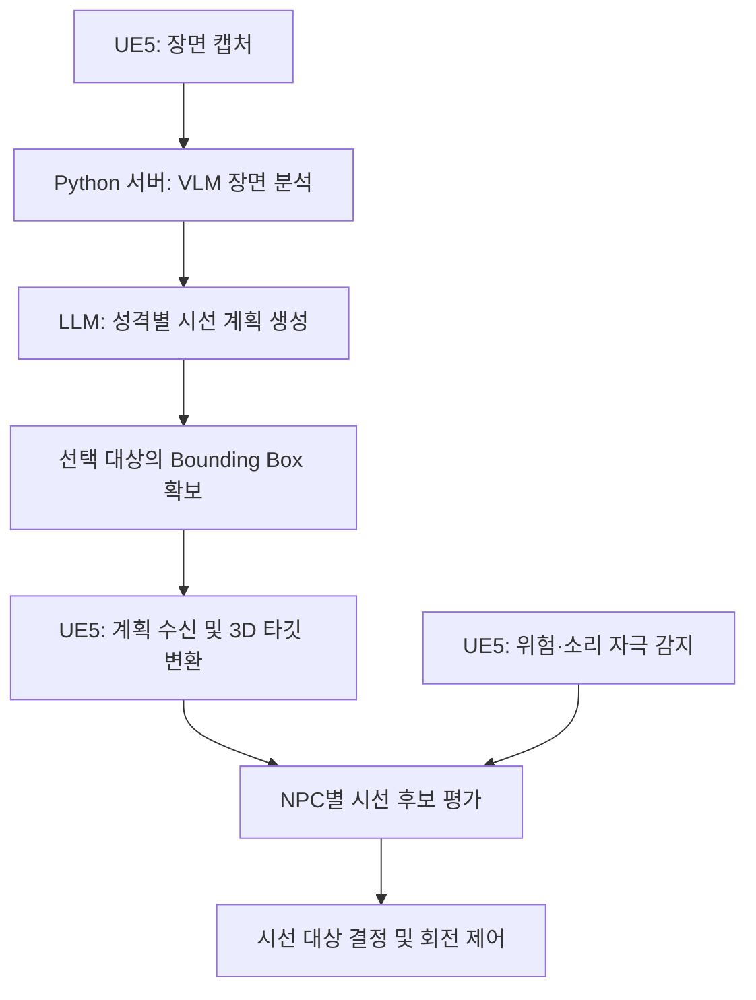

# 생성형 AI 기반 NPC 시선 제어 시스템

Unreal Engine 5에서 VLM의 장면 분석과 LLM의 성격별 시선 계획을
NPC의 시선 행동으로 연결한 개인 졸업 프로젝트입니다.

## 프로젝트 소개

게임 속 NPC가 주변 상황에 관심을 보이고 성격에 따라 서로 다른
반응을 한다면 플레이어가 세계를 더 생생하게 느낄 수 있다고 생각했습니다.

이를 구현하기 위해 NPC 시점의 화면을 VLM으로 분석하고
LLM이 인식된 객체와 NPC의 성격을 바탕으로
시선 대상·동기·유지 시간을 계획하도록 구성했습니다.
Unreal Engine에서는 이 계획을 실제 월드의 시선 타깃과 회전 동작으로 연결합니다.

또한 위험이나 소리 자극에는 서버 응답을 기다리지 않고
엔진 내부 로직으로 시선을 전환하도록 구현했습니다.

### 실행 모습

[NPC의 성격별 시선 행동과 실시간 자극 반응]

https://github.com/user-attachments/assets/87c5dcf2-8388-41ee-b0ca-b279346604ad

동일한 장면에서 성격에 따라 다른 대상을 바라보고,
위험이나 소리 자극이 발생하면 시선을 전환하는 모습입니다.

### 주요 기능

- **성격별 시선 행동**  
  신중형(Cautious), 조급형(Rusher), 호기심형(Sightseer)의
  성격에 따라 시선 대상과 자극에 대한 반응을 다르게 구성했습니다.

- **이미지 기반 시선 타깃 지정**  
  인식된 객체의 Bounding Box를 카메라 투영 정보와 Raycast를 이용해
  3D 월드의 시선 타깃으로 변환했습니다.

- **실시간 자극 반응**  
  위험 대상의 거리와 접근 속도 등을 평가하고
  NPC의 성격을 반영해 시선 판단에 적용했습니다.
  소리가 감지되면 소리 방향으로 반응하도록 구현했습니다.

- **중앙집중형 계획 관리**  
  장면 분석 결과를 공유하고 성격별 시선 계획을 생성·배포하여
  NPC별로 동일 장면을 중복 분석하는 구조를 개선했습니다.

## 개발 정보 및 담당 범위

### 개발 정보

| 항목 | 내용 |
|---|---|
| 개발 기간 | 2026.01 ~ 진행 중 |
| 프로젝트 형태 | 개인 졸업 프로젝트 |
| 개발 엔진 | Unreal Engine 5 |
| 사용 언어 | C++, Python |
| 주요 기술 | VLM·LLM API, HTTP/JSON, Scene Capture, Raycast |
| 담당 역할 | NPC 시선 제어 시스템 설계 및 구현 |

### 담당 범위

| 영역 | 구현 내용 |
|---|---|
| 장면 캡처 및 서버 연동 | Unreal의 장면 이미지를 캡처하고 Python 서버에 전송하는 통신 흐름 구현 |
| 성격별 시선 계획 | 장면 분석 결과와 NPC 성격을 바탕으로 시선 대상·동기·유지 시간을 생성하는 로직 구현 |
| 계획 관리 및 배포 | 서버 응답을 파싱하고 성격별 계획을 관리하여 각 NPC에 전달하는 구조 구현 |
| 시선 타깃 좌표 변환 | Bounding Box의 이미지 좌표를 월드 방향으로 변환하고, 다중 Raycast 결과로 3D 시선 타깃 결정 |
| 실시간 위험 반응 | 위험 대상의 거리·속도·예상 최근접 거리 등을 이용한 위험 평가와 성격별 시선 가중치 적용 |
| NPC 시선 동작 | 서버 계획과 주변 자극을 반영한 시선 선택, 소리 반응, 머리 회전 범위 제한 및 보간 구현 |
| 구조 개선 및 검증 | 장면 분석 공유를 통한 중복 요청 개선, 시선 동작 확인을 위한 디버그 시각화 및 결과 측정 |

### 외부 기술 활용 범위
- **Unreal Engine 5:** 렌더링, 장면 캡처, 충돌 검사 등 엔진 기능 활용
- **VLM·LLM API:** 이미지 분석과 시선 계획 생성을 위한 모델 추론 활용
- **직접 구현한 부분:** 모델 입출력 구성, UE5–서버 연동,

## 전체 시스템 구조

시스템은 **장면을 분석하고 시선 계획을 생성하는 Python 서버**와
**계획을 실제 NPC 행동으로 연결하는 Unreal Engine 5**로 구성했습니다.

위험·소리 자극은 UE5 내부에서 처리하여
서버 응답을 기다리지 않고 시선 판단에 반영합니다.



### 1. 장면 캡처 및 객체 인식

UE5에서 캡처한 장면 이미지를 Python 서버로 전송합니다.
서버는 VLM으로 이미지 속 객체를 분석하고,
시선 계획 생성에 사용할 객체 정보를 구성합니다.

<p align="center">
  
  
</p>


### 2. 성격별 시선 계획 생성

장면 분석 결과를 공유하고, LLM이 NPC 성격에 따라
시선 대상·동기·유지 시간·선택 이유를 생성합니다.
생성된 계획은 성격별로 구분하여 UE5에 전달합니다.


### 3. 이미지 속 객체를 3D 시선 타깃으로 변환

선택된 객체의 Bounding Box를 캡처 카메라의 투영 정보로
월드 방향으로 변환합니다.

박스 내부 9개 지점에 Raycast를 수행하고,
충돌 결과를 집계하여 실제 월드의 시선 타깃을 결정합니다.
이를 통해 사전 태그 매칭에 의존하던 타깃 지정 방식을 개선했습니다.


### 4. 실시간 시선 판단 및 동작 실행

각 NPC는 서버 계획과 위험·소리 자극을 시선 판단에 반영합니다.
성격별 가중치와 위험도 등을 바탕으로 시선 대상을 결정하고,
회전 범위 제한과 보간을 적용해 시선 동작으로 연결합니다.

https://github.com/user-attachments/assets/87c5dcf2-8388-41ee-b0ca-b279346604ad


## 핵심 C++ 구현 및 문제 해결

### 1. 여러 자극을 종합하는 NPC 시선 의사결정

NPC가 서버의 시선 계획을 수행하면서도 위험·소리·주변 NPC의 행동에
반응할 수 있도록 각 자극을 위치·강도·영향 범위를 가진 시선 후보로 구성했습니다.

각 후보 위치에서 모든 자극의 가우시안 점수를 합산하고
가장 높은 점수의 후보를 최종 시선 대상으로 선택합니다.
성격별 가중치를 적용하여 같은 장면에서도 NPC마다 다른 판단이 가능하도록 구현했습니다.

- **주요 구현:** `TArray` 기반 후보 관리, 가우시안 가중합, 성격별 우선순위
- **관련 함수:** `HandleNPCBehavior()`, `CalculateGaussianScore()`, `CalculateGMMBestPeak()`

[전체 판단 흐름 — HandleNPCBehavior](Source/jh_HeadRotation/NPCGazeDecisionComponent.cpp#L18) ·
[가우시안 점수 계산 — CalculateGaussianScore](Source/jh_HeadRotation/NPCGazeDecisionComponent.cpp#L41) ·
[최종 후보 선택 — CalculateGMMBestPeak](Source/jh_HeadRotation/NPCGazeDecisionComponent.cpp#L49)

### 2. 서버 응답을 기다리지 않는 위험 예측과 반응

돌발 위험에 대한 반응이 LLM의 응답 지연에 영향을 받지 않도록,
위험 평가는 Unreal Engine 내부에서 수행하도록 구성했습니다.

대상과 NPC의 상대 위치·속도로 예측 구간 내 최근접 거리를 계산하고
거리·접근 속도·충돌 위험 등을 종합해 위험도를 산출합니다.
이 위험도에 성격별 안전 가중치를 적용하여 시선 후보에 반영합니다.

- **주요 구현:** 벡터 내적, 상대 운동 기반 최근접 거리 예측, 위험 점수 계산
- **관련 함수:** `CollectSafetyStimuli()`, `AppendSafetyCandidates()`

[위험 평가 — AppendSafetyCandidates](Source/jh_HeadRotation/NPCGazeDecisionComponent.cpp#L151) ·
[위험 대상 수집 — CollectSafetyStimuli](Source/jh_HeadRotation/NPCPerceptionComponent.cpp#L168) ·
[위험 자극 컴포넌트 보기](Source/jh_HeadRotation/SafetyStimulusComponent.cpp)

### 3. 객체별 태그 설정을 줄여 제작 효율과 확장성 개선

객체마다 시선용 태그를 지정하고 연결하는 반복 작업을 줄이기 위해
VLM이 인식한 Bounding Box를 실제 월드의 시선 타깃으로 변환했습니다.

촬영 당시 카메라의 FOV·종횡비·Transform으로 월드 방향을 계산하고
Bounding Box 내부 9개 지점에 Raycast를 수행합니다.
Actor별 충돌 횟수를 집계해 대상을 선택한 뒤,
해당 Actor에 맞은 샘플 중 박스 중심과 가까운 충돌점을 시선 위치로 사용합니다.

- **주요 구현:** 이미지 좌표의 월드 방향 변환, 다중 Raycast, `TMap` 기반 충돌 집계
- **개선 효과:** 시선용 태그의 반복 설정을 줄이고 새로운 객체에도 동일한 로직 적용
- **관련 함수:** `SaveCaptureProjection()`, `TraceNormalizedBBox()`, `ResolvePlanBBoxToWorld()`

[촬영 정보 저장 — SaveCaptureProjection](Source/jh_HeadRotation/VisionCaptureActor.cpp#L593) ·
[좌표 변환·타깃 선택 — TraceNormalizedBBox](Source/jh_HeadRotation/VisionCaptureActor.cpp#L621) ·
[계획 타깃 변환 — ResolvePlanBBoxToWorld](Source/jh_HeadRotation/VisionCaptureActor.cpp#L778)

### 4. 주변 NPC의 행동을 반영하는 사회적 시선 반응

주변 NPC의 시야 포함 여부와 가림 여부를 확인하고
관찰한 행동의 지속 시간과 같은 대상을 바라보는 인원 등을 평가합니다.

관찰 지연과 시선 유지·재선택 대기 시간을 적용하여
사회적 시선이 지나치게 빠르게 전환되지 않도록 구성했습니다.

- **관련 함수:** `CanObserveNPC()`, `EvaluateSocialInfluence()`,
  `ActivateOrExtendSocialGazeLock()`, `ReleaseSocialGazeLock()`

[시야·가림 검사 — CanObserveNPC](Source/jh_HeadRotation/NPCPerceptionComponent.cpp#L18) ·
[사회적 영향 평가 — EvaluateSocialInfluence](Source/jh_HeadRotation/NPCGazeDecisionComponent.Social.cpp#L79) ·
[시선 유지 — ActivateOrExtendSocialGazeLock](Source/jh_HeadRotation/NPCGazeDecisionComponent.Social.cpp#L391) ·
[시선 유지 해제 — ReleaseSocialGazeLock](Source/jh_HeadRotation/NPCGazeDecisionComponent.Social.cpp#L437)

### 5. 시선 판단을 캐릭터 동작으로 연결

선택한 시선 방향을 NPC 기준 상대 회전으로 변환하고
Yaw·Pitch 범위 제한과 보간을 적용해 머리 회전에 반영합니다.
위험·소리 반응에 따른 이동 정지·방향 전환과 반응 종료 후 이동 재개도 연결했습니다.

- **관련 함수:** `UpdateHeadLookOffsets()`, `UpdateSoundReactionRotation()`,
  `UpdateReactiveMovement()`

[머리 회전 — UpdateHeadLookOffsets](Source/jh_HeadRotation/NPCGazeMotorComponent.cpp#L93) ·
[소리 반응 회전 — UpdateSoundReactionRotation](Source/jh_HeadRotation/NPCGazeMotorComponent.cpp#L18) ·
[이동 정지·복귀 — UpdateReactiveMovement](Source/jh_HeadRotation/NPCGazeMotorComponent.cpp#L114)


| 역할 | 파일 |
|---|---|
| 캐릭터 초기화 및 기능 연결 | [NPCCharacterBase.cpp](Source/jh_HeadRotation/NPCCharacterBase.cpp) |
| Eyes — 주변 자극 감지 | [NPCPerceptionComponent.cpp](Source/jh_HeadRotation/NPCPerceptionComponent.cpp) |
| Brain — 위험 평가 및 시선 선택 | [NPCGazeDecisionComponent.cpp](Source/jh_HeadRotation/NPCGazeDecisionComponent.cpp) |
| Brain — 사회적 반응 | [NPCGazeDecisionComponent.Social.cpp](Source/jh_HeadRotation/NPCGazeDecisionComponent.Social.cpp) |
| Body — 회전 및 이동 반응 | [NPCGazeMotorComponent.cpp](Source/jh_HeadRotation/NPCGazeMotorComponent.cpp) |
| 경로 및 목적지 이동 | [NPCCharacterBase.Navigation.cpp](Source/jh_HeadRotation/NPCCharacterBase.Navigation.cpp) |
| 측정 및 디버그 시각화 | [NPCCharacterBase.Metrics.cpp](Source/jh_HeadRotation/NPCCharacterBase.Metrics.cpp) |

기존 Blueprint 설정과 직렬화된 상태는 캐릭터에 유지하고,
컴포넌트가 해당 상태를 읽고 갱신하도록 구성했습니다.
세 컴포넌트는 독립적으로 Tick하지 않으며,
캐릭터가 기존 처리 순서에 맞춰 호출합니다.

### 6. 장면 분석 공유와 계획 통합으로 중복 호출 감소

성격별로 동일한 장면을 반복 분석하던 구조를 개선했습니다.
장면은 지점마다 한 번만 분석하고 세 성격의 시선 계획을
한 번의 모델 호출로 생성하도록 구성했습니다.

또한 같은 지점에서 동일한 타깃을 선택하면
타깃 위치 추정 결과를 재사용하여 중복 요청을 줄였습니다.

**핵심 코드 — 타깃 위치 추정 결과 공유**

실제 서버 구현에서 발췌한 코드입니다.
데이터 선택과 측정용 인자 등은 설명을 위해 생략했습니다.

```python
# 성격 간에도 동일 지점·타깃의 결과를 공유
cache_key = (
    persona if is_a else "SHARED",
    point_index,
    target_object.casefold(),
)

if cache_key not in grounding_cache:
    grounding_cache[cache_key] = ground_target(
        image_bytes,
        target_object,
        metric_metadata,
    )

grounding = grounding_cache[cache_key]
plan_item["bbox"] = grounding["bbox"]
plan_item["bbox_confidence"] = grounding["bbox_confidence"]
```

캐시는 한 번의 계획 생성 요청 안에서 유지됩니다.
개선 효과를 비교하기 위해 A/B 구조별 호출 횟수·토큰 사용량·소요 시간을
CSV로 기록하도록 구현했습니다.

## 실행 결과 및 검증
시선의 원인을 구분하기 위해 디버그 선을 색상별로 표시했습니다.

- **파란색:** 서버에서 생성한 시선 계획에 따른 타깃
- **노란색:** 소리 자극에 반응해 바라보는 타깃
- **초록색:** 주변 NPC의 행동에 영향을 받아 바라보는 사회적 시선 타깃

### 1. 성격별 시선 행동 비교

동일한 장면에서 신중형(Cautious), 조급형(Rusher),
호기심형(Sightseer) NPC의 시선 대상과 반응을 비교했습니다.

서버가 생성한 성격별 계획과 실행 중 선택된 시선 타깃을 확인하여
같은 환경에서도 성격에 따라 시선 행동이 달라지는지 검증했습니다.

### 2. 위험·소리 자극에 대한 반응

서버 계획을 수행하는 도중 위험 대상이 접근하거나 소리가 발생하는
상황에서, 로컬 판단에 따라 시선이 전환되는지 확인했습니다.

| 확인 항목 | 확인 내용 |
|---|---|
| 위험 반응 | 접근하는 위험 대상이 시선 판단에 반영되는지 |
| 성격별 차이 | 같은 자극에 대해 성격별 반응이 달라지는지 |
| 소리 반응 | 소리 후보가 선택되었을 때 해당 방향으로 반응하는지 |
| 이동 복귀 | 반응으로 정지한 뒤 기존 경로의 이동을 재개하는지 |

https://github.com/user-attachments/assets/2fca2d1b-0037-40fd-9c03-359cc578ebbd

https://github.com/user-attachments/assets/5192547a-d5e3-41e7-8307-d78ccbcddaa1

### 3. 시선용 태그가 없는 객체의 타깃 지정

사전에 시선용 태그를 지정하지 않은 테스트 객체 14종을 대상으로,
해당 테스트 환경에서 14종 모두 인식되는 것을 확인했습니다.

객체 인식 결과와 Bounding Box를 시각화하고
UE5의 시선 디버그 표시를 통해 실제 월드 타깃 연결을 확인했습니다.

더불어 tag없이도 다양한 환경에서 확장성 있게 시선 전환이 일어남을 확인했습니다.

### 4. 중앙집중형 구조의 효율 비교

성격별 독립 처리 방식(A)과 장면 분석 공유·계획 통합 방식(B)을
비교하기 위해 호출 횟수, 토큰 사용량, 처리 시간을 기록했습니다.

- 호출별 기록: `CallMetrics.csv`
- 실행별 집계: `RunSummary.csv`
- 비교 대상: 장면 분석, 계획 생성, 타깃 위치 추정 단계

| 지표 | A안: 성격별 독립 처리 | B안: 중앙 공유형 | 감소율 |
|---|---:|---:|---:|
| 총 Gemini 호출 | 28회 | 15회 | **46.4%** |
| 입력 토큰 | 15,087 | 8,155 | 45.9% |
| 출력 토큰 | 4,025 | 2,408 | 40.2% |
| 총 토큰 | 56,550 | 29,942 | **47.0%** |
| Gemini 호출 소요 시간 합계 | 374.4초 | 197.2초 | 47.3% |
| 서버 전체 경과 시간 | 376.3초 | 199.2초 | **47.1%** |
| 실패 호출 | 0회 | 0회 | 동일 |

해당 측정에서 중앙 공유형 구조는 성격별 독립 처리 대비
모델 호출을 46.4%, 총 토큰 사용량을 47.0% 줄였으며,
서버 전체 경과 시간은 47.1% 감소했습니다.

- 감소율: `(A안 − B안) / A안 × 100`
- Gemini 호출 소요 시간 합계: 개별 모델 호출에 걸린 시간의 합
- 서버 전체 경과 시간: 첫 스캔 분석부터 계획·타깃 위치 추정 완료까지의 경과 시간
- 총 토큰: API 응답의 `total_token_count` 기준

### 5. 현재 한계

- 객체 인식과 Bounding Box의 오차가 시선 타깃 지정에 영향을 줄 수 있습니다.
- 월드 타깃 지정에는 Raycast에 검출되는 충돌 설정이 필요합니다.
- 로컬 위험·소리 반응은 서버 응답과 분리했지만
  새로운 장면의 분석과 계획 생성에는 모델 응답 시간이 필요합니다.
