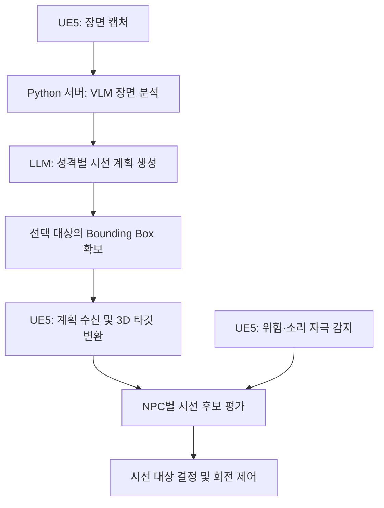

# 생성형 AI 기반 NPC 시선 제어 시스템

Unreal Engine 5에서 VLM의 장면 분석과 LLM의 성격별 시선 계획을
NPC의 시선 행동으로 연결한 개인 졸업 프로젝트입니다.

## 프로젝트 소개

게임 속 NPC가 주변 상황에 관심을 보이고 성격에 따라 서로 다른
반응을 한다면 플레이어가 세계를 더 생생하게 느낄 수 있다고 생각했습니다.

이를 구현하기 위해 NPC 시점의 화면을 VLM으로 분석하고
LLM이 인식된 객체와 NPC의 성격을 바탕으로
시선 대상·동기·유지 시간을 계획하도록 구성했습니다.
Unreal Engine에서는 이 계획을 실제 월드의 시선 타깃과 회전 동작으로 연결합니다.

또한 위험이나 소리 자극에는 서버 응답을 기다리지 않고
엔진 내부 로직으로 시선을 전환하도록 구현했습니다.

### 실행 모습

![NPC의 성격별 시선 행동과 실시간 자극 반응]

https://github.com/user-attachments/assets/87c5dcf2-8388-41ee-b0ca-b279346604ad

동일한 장면에서 성격에 따라 다른 대상을 바라보고,
위험이나 소리 자극이 발생하면 시선을 전환하는 모습입니다.

### 주요 기능

- **성격별 시선 행동**  
  신중형(Cautious), 조급형(Rusher), 호기심형(Sightseer)의
  성격에 따라 시선 대상과 자극에 대한 반응을 다르게 구성했습니다.

- **이미지 기반 시선 타깃 지정**  
  인식된 객체의 Bounding Box를 카메라 투영 정보와 Raycast를 이용해
  3D 월드의 시선 타깃으로 변환했습니다.

- **실시간 자극 반응**  
  위험 대상의 거리와 접근 속도 등을 평가하고
  NPC의 성격을 반영해 시선 판단에 적용했습니다.
  소리가 감지되면 소리 방향으로 반응하도록 구현했습니다.

- **중앙집중형 계획 관리**  
  장면 분석 결과를 공유하고 성격별 시선 계획을 생성·배포하여
  NPC별로 동일 장면을 중복 분석하는 구조를 개선했습니다.

## 개발 정보 및 담당 범위

### 개발 정보

| 항목 | 내용 |
|---|---|
| 개발 기간 | 2026.01 ~ 진행 중 |
| 프로젝트 형태 | 개인 졸업 프로젝트 |
| 개발 엔진 | Unreal Engine 5 |
| 사용 언어 | C++, Python |
| 주요 기술 | VLM·LLM API, HTTP/JSON, Scene Capture, Raycast |
| 담당 역할 | NPC 시선 제어 시스템 설계 및 구현 |

### 담당 범위

| 영역 | 구현 내용 |
|---|---|
| 장면 캡처 및 서버 연동 | Unreal의 장면 이미지를 캡처하고 Python 서버에 전송하는 통신 흐름 구현 |
| 성격별 시선 계획 | 장면 분석 결과와 NPC 성격을 바탕으로 시선 대상·동기·유지 시간을 생성하는 로직 구현 |
| 계획 관리 및 배포 | 서버 응답을 파싱하고 성격별 계획을 관리하여 각 NPC에 전달하는 구조 구현 |
| 시선 타깃 좌표 변환 | Bounding Box의 이미지 좌표를 월드 방향으로 변환하고, 다중 Raycast 결과로 3D 시선 타깃 결정 |
| 실시간 위험 반응 | 위험 대상의 거리·속도·예상 최근접 거리 등을 이용한 위험 평가와 성격별 시선 가중치 적용 |
| NPC 시선 동작 | 서버 계획과 주변 자극을 반영한 시선 선택, 소리 반응, 머리 회전 범위 제한 및 보간 구현 |
| 구조 개선 및 검증 | 장면 분석 공유를 통한 중복 요청 개선, 시선 동작 확인을 위한 디버그 시각화 및 결과 측정 |

### 외부 기술 활용 범위
- **Unreal Engine 5:** 렌더링, 장면 캡처, 충돌 검사 등 엔진 기능 활용
- **VLM·LLM API:** 이미지 분석과 시선 계획 생성을 위한 모델 추론 활용
- **직접 구현한 부분:** 모델 입출력 구성, UE5–서버 연동,

## 전체 시스템 구조

시스템은 **장면을 분석하고 시선 계획을 생성하는 Python 서버**와
**계획을 실제 NPC 행동으로 연결하는 Unreal Engine 5**로 구성했습니다.

위험·소리 자극은 UE5 내부에서 처리하여
서버 응답을 기다리지 않고 시선 판단에 반영합니다.

### 1. 장면 캡처 및 객체 인식

UE5에서 캡처한 장면 이미지를 Python 서버로 전송합니다.
서버는 VLM으로 이미지 속 객체를 분석하고,
시선 계획 생성에 사용할 객체 정보를 구성합니다.

<!-- 이 아래에 장면 캡처와 객체 인식 결과 이미지를 넣습니다. -->

  
  

### 2. 성격별 시선 계획 생성

장면 분석 결과를 공유하고, LLM이 NPC 성격에 따라
시선 대상·동기·유지 시간·선택 이유를 생성합니다.
생성된 계획은 성격별로 구분하여 UE5에 전달합니다.

<!-- 이 아래에 성격별 계획 생성 결과 이미지를 넣습니다. -->

### 3. 이미지 속 객체를 3D 시선 타깃으로 변환

선택된 객체의 Bounding Box를 캡처 카메라의 투영 정보로
월드 방향으로 변환합니다.

박스 내부 9개 지점에 Raycast를 수행하고,
충돌 결과를 집계하여 실제 월드의 시선 타깃을 결정합니다.
이를 통해 사전 태그 매칭에 의존하던 타깃 지정 방식을 개선했습니다.

<!-- 이 아래에 Bounding Box가 표시된 이미지를 넣습니다. -->

### 4. 실시간 시선 판단 및 동작 실행

각 NPC는 서버 계획과 위험·소리 자극을 시선 판단에 반영합니다.
성격별 가중치와 위험도 등을 바탕으로 시선 대상을 결정하고,
회전 범위 제한과 보간을 적용해 시선 동작으로 연결합니다.

<!-- 이 아래에 NPC 반응 이미지 또는 영상을 넣습니다. -->

https://github.com/user-attachments/assets/b2faaca9-48dc-4386-b354-4764c058a067

